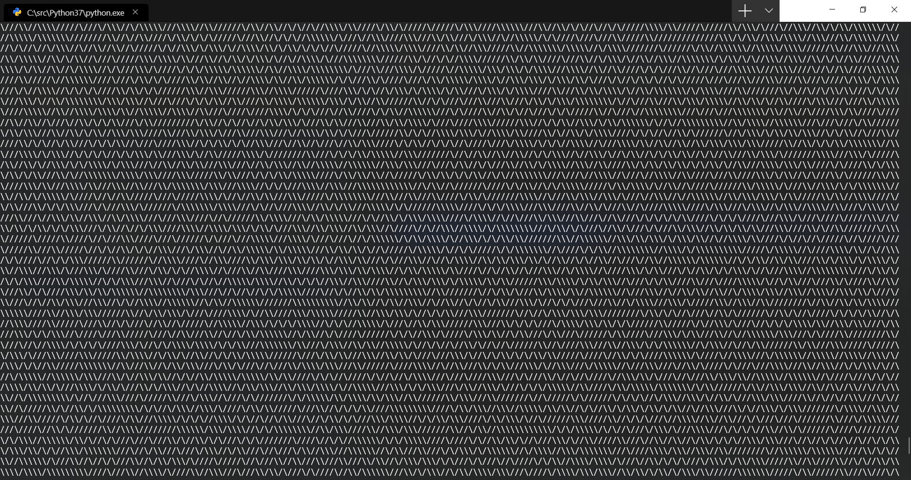

# Python 3 (61 bytes)

#### Executing

	$> python 10print.py

#### Explanation
Source code:

	import random as r
	while 1:print(r.choice(('\\','/')),end='')

This is equivalent to:

	import random as r
	
	while 1:  # Same as `while True` since 1 is truthy
		# random.choice(iterable) returns a randomly selected element from the iterable.
		# Also, we specify end='' because by default Python adds a new line after printing
		print(r.choice(('\\', '/'), end='')
		
#### Output

