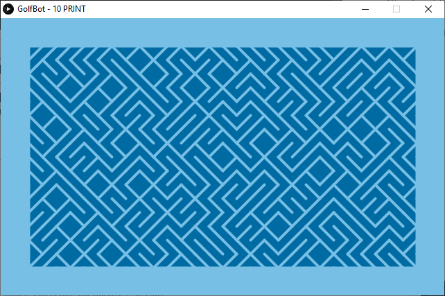

Solving 10 PRINT in Processing 3.

Instructions:
- Download and install the latest version of Processing from their [website](https://processing.org/download/).
- Run processing.exe in the installation directory (not the one ending with -java!)
    - Open the File dropdown and then press Open... (alternatively use the shortcut CTRL + O)
    - Navigate to the directory with hyphena.pde and open the file.
    - Run the program by pushing... run.
- Check out the result with your eyes!

If all goes well, you'll get a window like this one:

Feel free to tweak the code and do as you'd like with it! Optimize it perhaps.