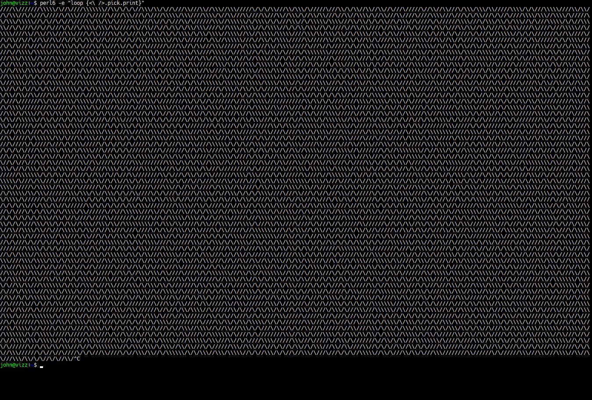

## 10print in Perl 6 (23 Characters)!

### Instructions:
- Acquire Rakudo Perl 6 ([here](https://perl6.org/downloads/) or via your favorite package manager)
- Run the code from a file with `perl6 10print.p6` or, alternatively, run it by doing `perl6 -e "loop {<\ />.pick.print}"`

You should get something which looks like the following:


### Breakdown:
We start with our full oneliner, `loop {<\ />.pick.print}`, which with a little more whitespace might look like:
```perl6
loop {
    <\ />.pick.print
}
```
or equivalently,
```perl6
loop {
    print <\ />.pick
}
```
The choice to call print as a method rather than as a standalone function in this case is arbitrary.

So, let's break it down:
- `<\ />` creates a list of strings, `("\\", "/")` via [word quoting](http://docs.perl6.org/language/quoting#Word_quoting:_<_>)
- [`.pick`](http://docs.perl6.org/routine/pick#(List)_routine_pick) is a method which, when supplied no other arguments, returns a random element of the invocant
- [`.print`](http://docs.perl6.org/routine/print) is pretty standard, it prints a given string without adding a trailing newline

Putting this all together, `<\ />.pick.print` prints a random element of the list `("\\", "/")`.

Slap a [`loop {...}`](http://docs.perl6.org/language/control#loop) around that and you've got 10print!

