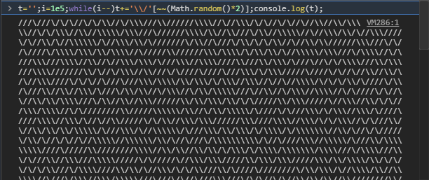

# Javascript (Browser & NodeJS) - 64 chars

### Demo

#### Browser

Copy the content of [`10print.js`](10print.js) in your console and press enter.

#### NodeJS

Run

```bash
node 10print.js
```

#### Screenshot 


________

#### Notes

I wonder if there would be a shorter way to loop other than the basic `for`.

