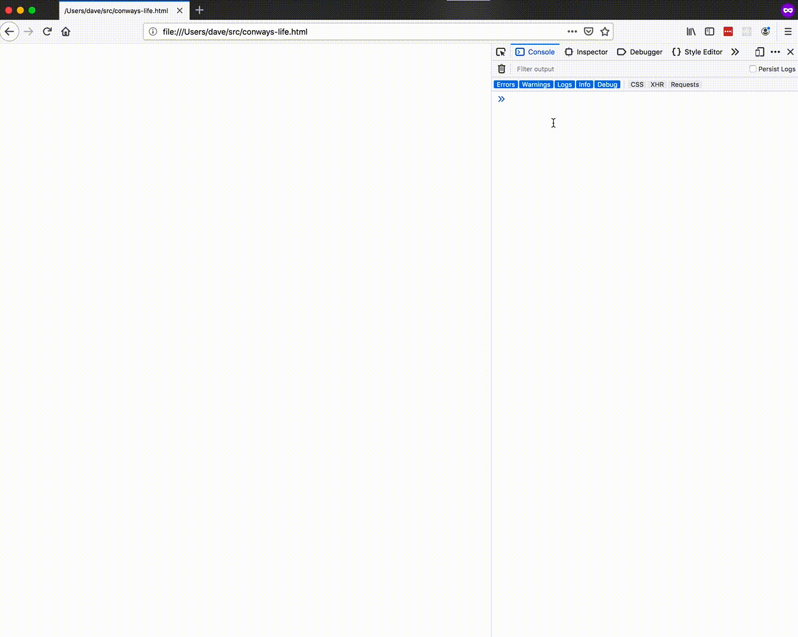

# Conway's Life...

## ...in 114 characters of javascript.

[A javascript implementation](./conways-life.js) that adds a global function `l` that takes a generation of cells in the following format:

```
[
  [0,0,0,0,0],
  [0,0,0,0,0],
  [0,1,1,1,0],
  [0,0,0,0,0],
  [0,0,0,0,0],
]
```

and returns the next generation.

See [the explanation of how it works](./conways-life-explained.js).

## ...in the browser in 248 characters
[HTML page](./conways-life.html) that renders conway's life.
Open your console and set the global variable b to an array like the one above to use it.

Here's a script that will seed it with a random 32x32 grid:
`b=new Array(32).fill(0).map(() => new Array(32).fill(0).map(() => Math.floor(Math.random() * 2)))`


