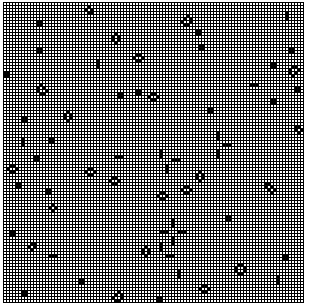

# Javascript - 139 chars

### Demo

Open [`test.html`](test.html) in your browser.  
Every time you refresh the page, it generates another random seed.

#### Screenshot 

________

#### Notes

The search for neighbours seems unefficient, I wonder how else it could be done.
