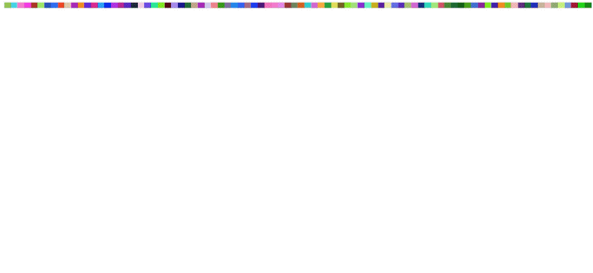

## Hex + HTML
Renders a random color to the screen every 33 milliseconds, building an animated pixel display (thanks to flexbox), in 213 characters.

```html
<script>m=Math;setInterval(()=>x.innerHTML+=`<b style='flex:1 0 1%;height:1vh;background:#${m.floor(m.random()*(1<<24)).toString(16).padStart(6,'0')}'/>`,33);</script><i id='x'style='display:flex;flex-wrap:wrap;'>
```

