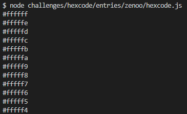

# Javascript (Browser & NodeJS) - 62 chars

### Demo

#### NodeJS

Run

```bash
node hexcode.js
```

#### Browser

**NOT RECOMMENDED, MIGHT FREEZE YOUR TAB !**  
Copy the content of [`hexcode.js`](hexcode.js) in your console and press enter.
**

#### Screenshot




________

#### Notes

I'm unhappy with the *char to use* ratio of the `padStart` method, still trying to find something better.
