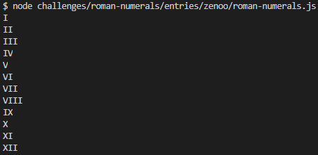

# Javascript (Browser & NodeJS) - 205 chars

### Demo

#### NodeJS

Run

```bash
node roman-numerals.js
```

#### Browser

Copy the content of [`roman-numerals.js`](roman-numerals.js) in your console and press enter.
**

#### Screenshot




________

#### Notes

I'm not sure my way of mapping roman characters to integers is the best one.